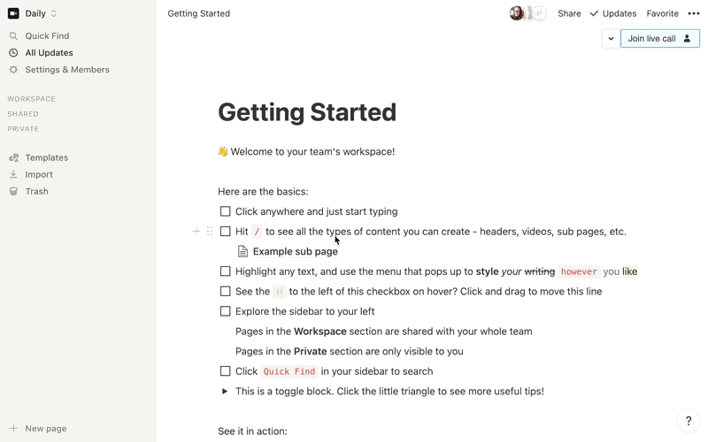
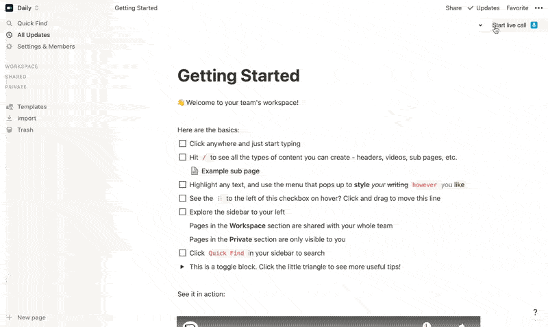

# Daily Collab: Embed and transcribe Daily calls in Notion pages

### Demo Chrome extension app from [Daily](https://www.daily.co/)

Daily Collab is a demo Chrome extension that allows users to embed and transcribe Daily calls directly into Notion workspaces.

The extension can be run locally or downloaded from the [Chrome store](https://chrome.google.com/webstore/detail/collab-video-calls-in-not/ikmjimibciifjefngaabnojnnlclfhnj). Once the extension has been added to your browser, Daily calls can be started or joined from any Notion workspace page.

To transcribe videos, the extension needs to be authorized by a Notion workspace admin. Once authorized, admins will receive an access code they can share with workspace members for each member to authorize the extension to edit Notion pages via transcription text additions.

This demo uses a custom Daily API built for this project. The API is currently private so any forked versions must use the private API's endpoints (or your own custom ones) for Daily room creation.

The API repo will be made public once transcription—an upcoming Daily feature— is public. :)

---

## Setup

### Requirements

To use this Chrome extension locally, you will need to create a [Notion workspace](https://www.notion.so).

### Running and adding the Chrome extension locally

1. Clone this repository.
2. Run `npm install` to install the dependencies.
3. Run `npm run start`
4. Load your extension on Chrome following:
   1. Access `chrome://extensions/`
   2. Check `Developer mode`
   3. Click on `Load unpacked extension`
   4. Select the `build` folder.

---

## Usage

This extension will only load on Notion.so pages and otherwise has no impact on your browser.

To start a call, choose an audio or video-only call and whether you'd like the transcription feature enabled. (Video calls are the default and transcription is off by default.) Before joining the call, you will see the "Lobby" view, where you can select which media devices you would like to use, and see a video preview of yourself before entering the call.

For others to join the call, they can visit the same Notion page you're viewing and click `Join live call`. They must also have the Chrome extension installed to see this button.

### Authorizing transcription

The transcription feature requires Daily Collab to use the Notion API, which must be authorized by a Notion workspace admin.

To enable this feature as a workspace member, you will need to authorize transcription locally by submitting your workspace access code through Daily Collab's `Members` authorization form.

Only an admin can get the workspace access code. To get this code, a workspace admin must follow the auth flow via Daily Collab's `Admin` authorization form, (i.e. Click the `Authorize` button.)

If you are both an Admin and would like to use the transcription feature, follow the admin auth flow and submit the code through the `Members` form.

### Using the transcription feature

Once transcription is authorized, it can be enabled for any call. Transcription can be started once you are in the call via the `Start transcription` button. Transcription can be stopped at any point during a live call.

_Note: Transcription typically has a ~5 second delay before text will start appearing in the Notion page._

Admins must explicitly allow write access for Notion documents, so any transcription errors may mean the page has not been authorized yet. (If this happens, contact your Notion admin to authorize that Notion page through the Admin auth flow.)

## Boilerplate

This demo uses [this](https://github.com/lxieyang/chrome-extension-boilerplate-react#readme) Chrome Extension boilerplate.

---

## Related blog posts/tutorials

Learn more about this demo on the [Daily blog](https://www.daily.co/blog/tag/collab-chrome-extension/).

- [Introduction to the Daily Collab blog series](https://www.daily.co/blog/embed-and-transcribe-a-daily-video-call-in-any-notion-doc/)
- [Understanding the anatomy of a Chrome extension](https://www.daily.co/blog/the-anatomy-of-a-daily-video-call-chrome-extension/)
- [How to use the Notion API to authorize the Daily Collab transcription feature](https://www.daily.co/blog/authorizing-dailys-chrome-extension-beta-transcription-feature-with-notions-api/)
